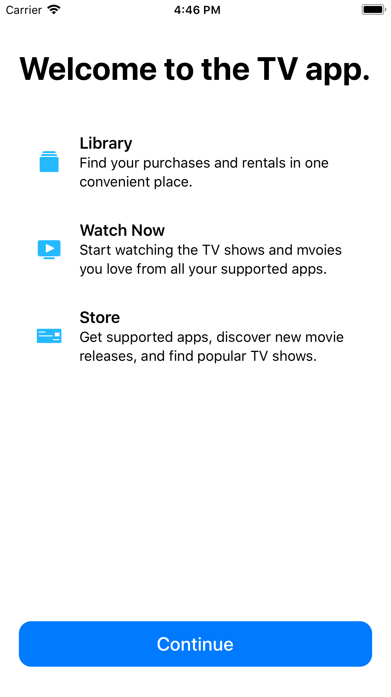

[][lionheart-url]

### A welcome view in the style of Apple's built-in apps.

[![CI Status][ci-badge]][travis-repo-url]
[![Version][version-badge]][cocoapods-repo-url]
[![License][license-badge]][cocoapods-repo-url]
[![Platform][platform-badge]][cocoapods-repo-url]
[![Swift][swift-badge]][swift-url]

<!--
[![CocoaPods][downloads-badge]][cocoapods-repo-url]
[![CocoaPods][downloads-monthly-badge]][cocoapods-repo-url]
-->

## Example

To run the example project, clone the repo, and run `pod install` from the Example directory first.



## Usage

Create an enum with all of the features you'd like to summarize:

```
enum WelcomeItem {
    case library
    case watchNow
    case store
}
```

Make the enum conform to `WelcomeCardProvider`.

```swift
extension WelcomeItem: WelcomeCardProvider {
    var title: String {
        switch self {
        case .library: return "Library"
        case .watchNow: return "Watch Now"
        case .store: return "Store"
        }
    }

    var description: String {
        switch self {
        case .library: return "Find your purchases and rentals in one convenient place."
        case .watchNow: return "Start watching the TV shows and movies you love from all your supported apps."
        case .store: return "Get supported apps, discover new movie releases, and find popular TV shows."
        }
    }

    var imageName: String? {
        switch self {
        case .library: return "Categories"
        case .watchNow: return "Preview"
        case .store: return "Check"
        }
    }

    var color: UIColor? {
        return UIColor(.RGB(37, 185, 255))
    }
}
```

Lastly, instantiate `WelcomeViewController`:

```swift
let controller = WelcomeViewController<WelcomeItem>(header: "Welcome to the TV app.", buttonText: "Continue", callouts: [.library, .watchNow, .store], delegate: nil)
```

To attach an action when someone taps the button, set the `delegate` to an object conforming to `WelcomeViewControllerDelegate`.

```swift
extension MyViewController: WelcomeViewControllerDelegate {
    func welcomeViewControllerButtonDidTouchUpInside(_ sender: Any) {
        dismiss(animated: true)
    }
}
```

## Installation

WelcomeViewController is available through [CocoaPods][cocoapods-url]. To install it, simply add the following line to your Podfile:

```ruby
pod 'WelcomeViewController'
```

## Author

[Dan Loewenherz](https://github.com/dlo)

## License

WelcomeViewController is available under the Apache 2.0 license. See the [LICENSE](LICENSE) file for more info.

<!-- Images -->

[ci-badge]: https://img.shields.io/travis/lionheart/WelcomeViewController.svg?style=flat
[version-badge]: https://img.shields.io/cocoapods/v/WelcomeViewController.svg?style=flat
[license-badge]: https://img.shields.io/cocoapods/l/WelcomeViewController.svg?style=flat
[platform-badge]: https://img.shields.io/cocoapods/p/WelcomeViewController.svg?style=flat
[downloads-badge]: https://img.shields.io/cocoapods/dt/WelcomeViewController.svg?style=flat
[downloads-monthly-badge]: https://img.shields.io/cocoapods/dm/WelcomeViewController.svg?style=flat
[swift-badge]: https://img.shields.io/badge/swift-4-blue.svg

<!-- Links -->

[semver-url]: http://www.semver.org
[travis-repo-url]: https://travis-ci.org/lionheart/WelcomeViewController
[cocoapods-url]: http://cocoapods.org
[cocoapods-repo-url]: http://cocoapods.org/pods/WelcomeViewController
[doc-url]: https://code.lionheart.software/WelcomeViewController/
[lionheart-url]: https://lionheartsw.com/
[swift-url]: https://swift.org

